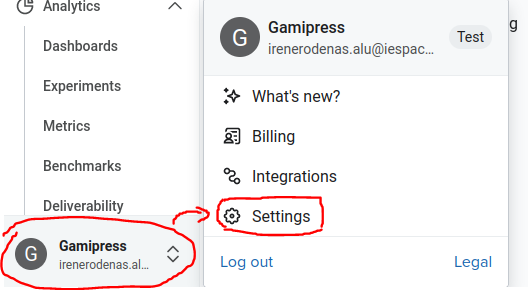
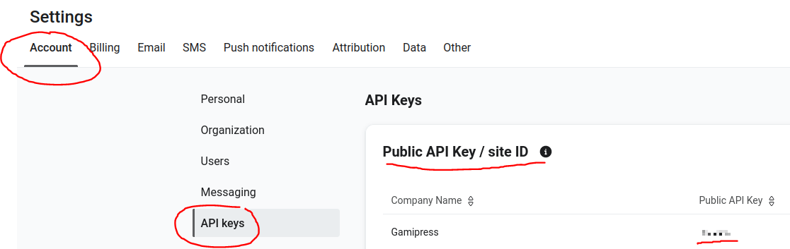
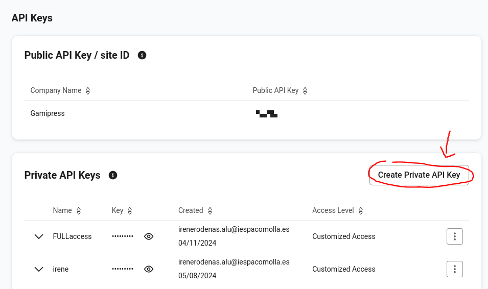
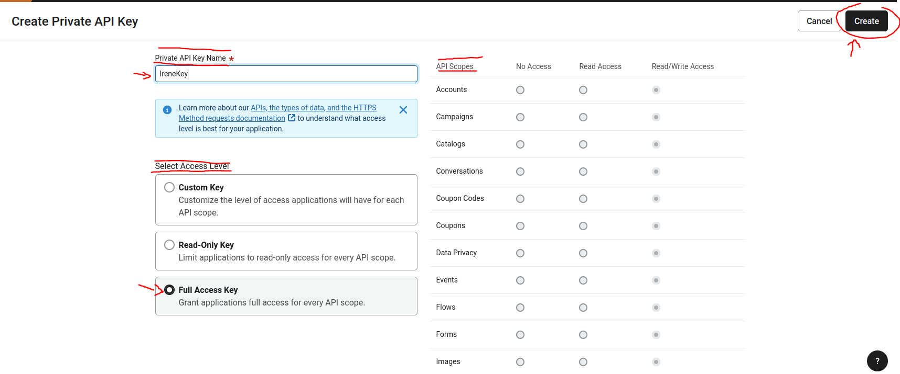
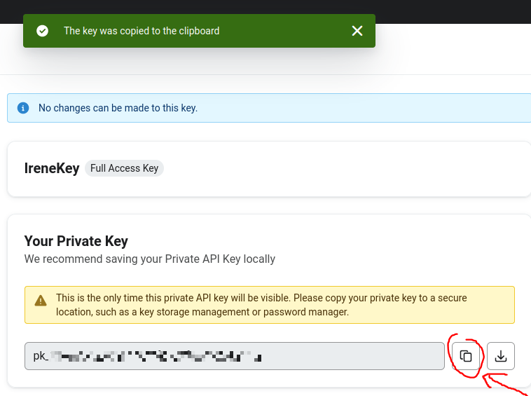
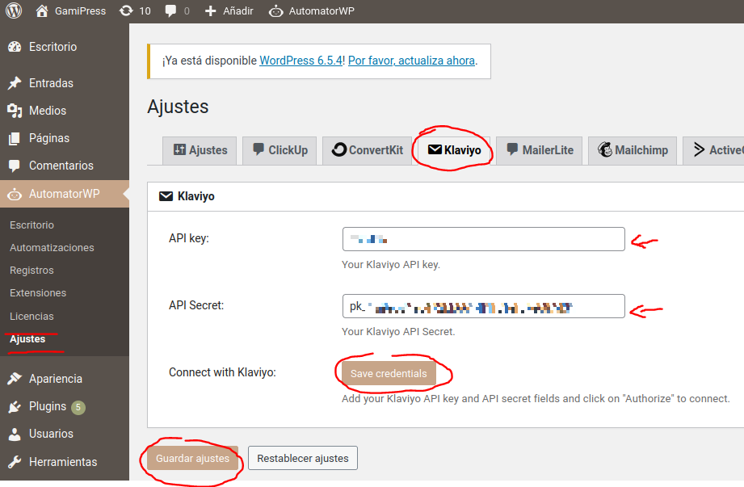
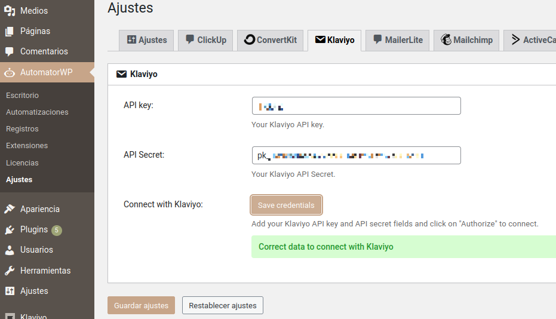

# Connect AutomatorWP with Klaviyo

Before starting with this guide, here is everything you will need:

+ Our [Klaviyo add-on](https://automatorwp.com/add-ons/klaviyo/).
+ A [Klaviyo account](https://www.klaviyo.com/).

## Connect AutomatorWP with Klaviyo

**1** - In your Klaviyo account dashboard, click on your username in the bottom left corner and then click on **Settings** in the list of options.

**2** - Within the account settings and click on **API Keys**. That's where your Public API Key would be.

**3** - To create a Private API key, click on **Create Private API Key**.

**4** - Set a name for the key and select the permissions you want to grant through the key. Once finished, click on the **Create API Key** button located at the bottom right corner.

**5** - Copy the Private API key or download it and keep it safe.

> [!CAUTION]
> The API key **must** be stored in a safe place, as it will no longer be visible. If it is lost, a new API key will have to be created.

**6** - Once the key is copied, go to the control panel of your site. Go to **AutomatorWP > Settings > Klaviyo**, paste the API key generated earlier and click on **Save credentials**.

**7** - If the connection was successful, a message will appear informing about it. Finally, click on **Save Settings**.

